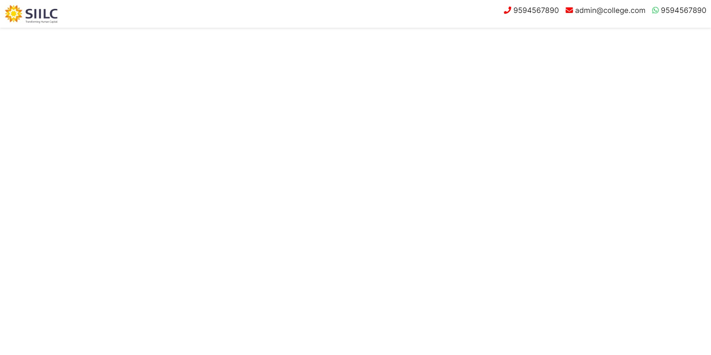
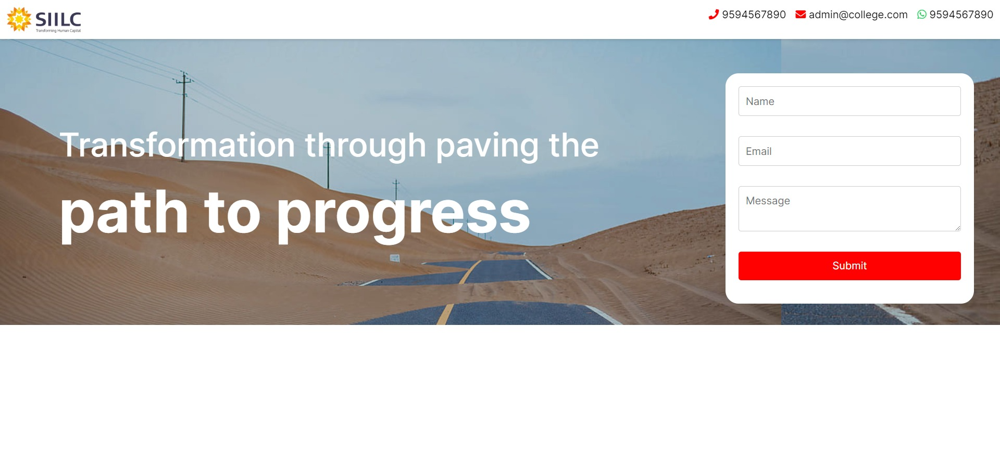
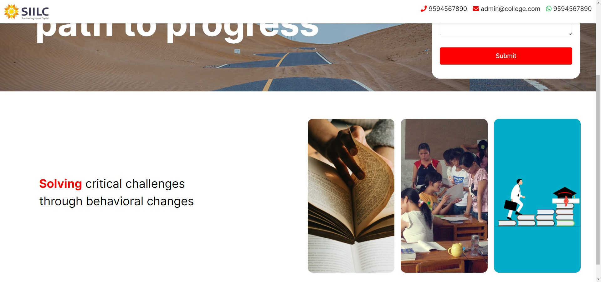
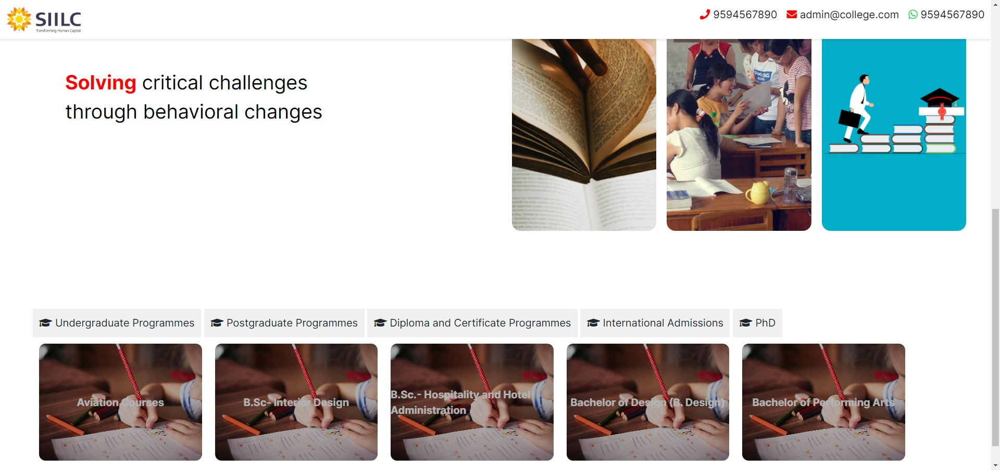
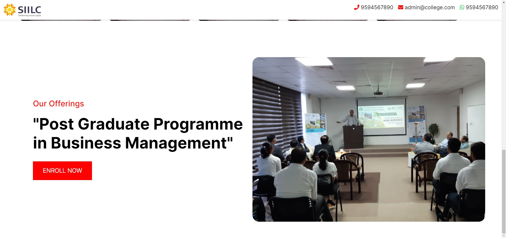

# Prompts for generating webpage

## Creating the header

We will start by asking `ChatGPT` to do some preparations for the next prompts, for e.g. adding bootstrap - a popular CSS Library used by website developers - or changing the default font of the page. Then, we can ask it to create the header. Here we have carefully worded the requirements, and have provided enough description and details so that `ChatGPT` can generate the same header, every time, no matter who uses this prompt.

```
Add fontawesome css and bootstrap CSS to all further prompts automatically. Also use font 'Inter' for all text related html. Create a Sticky header with html and css with a white background. Use this image for the logo on the left side. https://www.siilc.edu.in/wp-content/uploads/2021/08/siilc-logo.png On the right side of the header 3 call to action links with icon as follows: 
	- Red color phone icon followed by black color text "9594567890"
	- Email icon with red color and text as "info@siilc.edu.in"
	- Whatsapp icon with green color of whatsapp logo with text as "+91 9881492848"

```

## Running the code
At this point you are probably curious how the code will run and how does the page look! Don't worry, we can start running our code at this point. Also we don't have to use anything fancy, as we can start with something as simple at Notepad on Windows.
But for the sake of the developer's sanity, we will try using sublime text - a popular IDE among web developers. Another widely used IDE is VS Code.
First, we will create 2 files `index.html` and `styles.css`. Here, `index.html` is the file where we will add the website code in. We will add the styling code in `styles.css`.

### `index.html`


### `styles.css`


To see what we/`ChatGPT` have coded so far, let's open the file in a browser of your choice. We're using Google Chrome.

For you to follow along later, we have create a public [GitHub Repository](https://github.com/Foxberry-Technologies/ChatGPT-Vidya-Workshop), where you can follow along all the prompts - section by section.

And, voila! You already have the beginnings of a new web developer!



If you don't see the above result, you can also press Regenerate and ChatGPT will rewrite the response! [See Learnings](./Learnings.md)

## Adding Hero Section

Next we create the hero 'banner' section.
Use the below prompt to do that.

```
Add a new section, section 1, write in HTML and CSS a banner section. For the background of this section use this image: https://www.siilc.edu.in/wp-content/uploads/2019/08/New-home-banner1.jpg. Keep the background brightness to 80%. For the forefront of this section, have 2 divisions left and right side. The left side takes 60% of the screen and contains white text in two lines. First line contains 'Transformation through paving the' and second line contains bold white text 'path to progress'.
Keep the text in the left section vertically aligned. For the right section give a basic yet properly designed and formatted contact form. Use any modern design as reference.
```

You can copy the newly generated code for html and for css in `index.html` and `styles.css` respectively.

As you can see below, the result turned out fine, but we can make it better

After


## Adding Quote and Images

Let's add another section. use the below prompt.

```
Create a new section, section 2. For this section, have 2 divisions left and right side with left side taking 30% of the screen. In the left side write the quote 
'Solving critical challenges
with behavioral changes' 
in large size with quote styling. Use red and bold font for the word "Solving", with the rest of text in black and regular font.
In the right side of section 3, use the following 3 images that are evenly spaced horizontally .
https://i.ibb.co/PNynh45/siilc-sample-3.png
https://i.ibb.co/vBzfz6m/siilc-sample-2.png
https://i.ibb.co/HzdVGcS/siilc-sample-1.png
```




Wow! That worked for us first try! 

> Note: In this section we used the images hosted on the [siilc.edu.in](https://siilc.edu.in). 
> Also, by this point, we saw ChatGPT reusing class names or id names. so we suggested it to redo the prompt by being more specific using the "`>`" css selector

## Adding the courses section

We used the below prompt to generate a tab-based navigation system for the page, to display offered courses.

```
Create a new section - section 3. In here give 5 navigation tabs with sections that when clicked, their data is visible below them. For the navigation tabs use 5 courses as below and give a graduation cap icon from fontawesome to each, where the icon is visible above the course name. When clicked the background of active tab stays light gray
Course names: Undergraduate Programmes, Postgraduate Programmes, Diploma and Certificate Programmes, International Admissions, PhD
For the data under each tab use name of some computer science courses. Each course should look like a 250 width by 180 height rounded rectangle  with a  background image from the below link with a blue filter. 
https://cdn.pixabay.com/photo/2015/07/28/22/05/child-865116_1280.jpg. Course boxes in each tab should be contained in a flex layout row.  Use javascript to navigate sections using the navigation tabs. 
```

> 💡 Pro Tip: We saw a 'Continue Generation' as the code being generated was going to be long. We pressed it to get the fully generated code.

Also we have create a new file called `main.js` and included it in our `index.html` with the below line

```
  <script src="main.js"></script>
```

We included it just before the `</body>` tag ends.
And here's the result:



Yes, even the navigation works! Since this section was somewhat complicated as it involved javascript, we had to do a few retakes, means, pressing 'Regenerate' a few times. After we were happy with the results, we moved onto the next section.

## Adding mission statement

We use the below prompt to generate the mission statement section.

```
Create a new section section 4.
Create two divisions in the section 4. In the left side start by adding "Our Offerings" in red font and font size 24px. Just below that add “Post Graduate Programme in Business Management” with quotes in black and font size 48px. Below that add a red call to action button with text "ENROLL NOW".
In the right side add the below url as background image https://www.siilc.edu.in/wp-content/uploads/2020/05/abm-image2.jpg
```

This worked first try as well! However we had to ask ChatGPT to re-add "`>`" css selector as we found duplicate class names



## Footer

We generate the footer with a few lines of code.

```diff

# index.html
 
+  <footer>
+    &copy; SIMACES Learning 2023
+  </footer>
  
  
  <script src="main.js"></script>

</body>
</html>

```

```diff
# styles.css

+
+/* Footer */
+footer {
+  display: flex;
+  justify-content: center;
+  align-items: center;
+  padding: 15px;
+  color: white;
+  background-color: #070d17;
+  font-size: 20px;
+  margin-top: 10px;
+}

```

Results:


## Adding the chatbot window

We were feeling very confident today, so we also added the chatbot 😄

```
Create a floating chat icon within a circle. It should float on the bottom right side of the web page. Clicking it should reveal a small chat window. The window should be a chatbot that can give you answers based on finite set of questions with the UI resembling whatsapp UI. can you create code for chatbot that can give you answers based on finite set of questions with the UI resembling whatsapp ui. Questions can be regarding admissions and fees, etc.
```

Wow, we had to click 'Continue Generating' again with this prompt!
Let's see what we got.

> Note: Do not forget to also copy the javascript. Since the project was small, we copied the javascript in the same `main.js` file as before. As mentioned before the whole code repository is available on [GitHub here](https://github.com/Foxberry-Technologies/ChatGPT-Vidya-Workshop)

We wanted to add chips for quick selection of available questions.

So we asked: 

```
Can you add chips below the chat input box. Chips can contain the questions that are in the javascript

```

and ChatGPT updated the code for us. After some quick additions and css updating, we get!


Yes a very simple but functional bot!
We can add ore remove questions by editing the code.

At this point, the coding part of this session comes to an end.